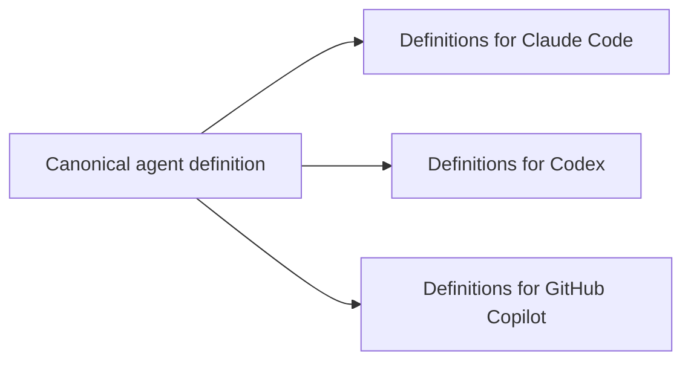

# agent-def-translator

`agent-def-translator` translates one canonical coding-agent definition into
platform-native agent files for Claude Code, OpenAI Codex, and GitHub Copilot.

Use it when you want to keep agent roles, descriptions, and instructions in one
reviewable TOML file, then generate the files each coding-agent product expects.
It is a translator only: it does not run agents, manage sessions, resume tasks,
or provide an orchestration runtime.



## Status

This project is currently alpha software. The core translation model is usable,
but the canonical definition shape and target-specific output formats may change
before a stable release.

## Quick Start

Create a definition directory:

```text
agents/
  repo-explorer.toml
prompts/
  repo-explorer.claude.md
```

Write a canonical definition:

```toml
name = "repo-explorer"
description = "Read repository context and summarize relevant files."
instructions = """
Inspect repository rules, locate the relevant files, and report concise findings
with file paths. Do not edit files.
"""

[targets.claude]
tools = ["Read", "Grep", "Glob"]
permission_mode = "plan"
model = "haiku"
prompt_append_file = "../prompts/repo-explorer.claude.md"

[targets.codex]
model = "gpt-5.4-mini"
sandbox_mode = "read-only"

[targets.copilot]
tools = ["search", "fetch"]
target = "vscode"
```

Validate and generate artifacts:

```bash
uvx agent-def-translator validate --definitions-dir agents
uvx agent-def-translator translate --definitions-dir agents --output-dir generated
```

This writes:

```text
generated/
  claude/agents/repo-explorer.md
  codex/agents/repo-explorer.toml
  copilot/agents/repo-explorer.agent.md
```

Check generated files in CI without rewriting them:

```bash
uvx agent-def-translator diff --definitions-dir agents --output-dir generated
```

`diff` exits with `0` when generated files are current, and `1` when any target
file is missing or stale.

## Documentation

- [CLI usage](docs/cli.md): command reference and common workflows.
- [Definition format](docs/definition-format.md): TOML fields, target tables,
  prompt composition, and output paths.
- [Platform references](docs/references.md): official documentation used to
  ground target-specific output formats, plus adjacent future-scope concepts
  such as MCP.
- [Development](docs/development.md): local setup, tests, checks, and optional
  E2E smoke tests.

## Python API

The command line interface is the recommended integration point for downstream
repositories because it keeps callers dependent on the public command contract.
A Python API is available for advanced embedding:

```python
from pathlib import Path

from agent_def_translator import Target, generate

generated = generate(
    definitions_dir=Path("agents"),
    output_dir=Path("generated"),
    targets=(Target.CLAUDE, Target.CODEX, Target.COPILOT),
)
```

## Scope

- Canonical definitions live in TOML files.
- Platform-specific differences live in `[targets.<target>]` tables.
- Generated files are deterministic and disposable.
- The canonical format captures shared role intent; native platform files are
  generated as target-specific projections.
- MCP server configuration is not translated yet; it is tracked as future scope
  in [Platform references](docs/references.md).
- Concrete workflow skills are out of scope; examples are intentionally tiny,
  such as `examples/skills/hello/SKILL.md`.

## License

MIT License. See `LICENSE`.
