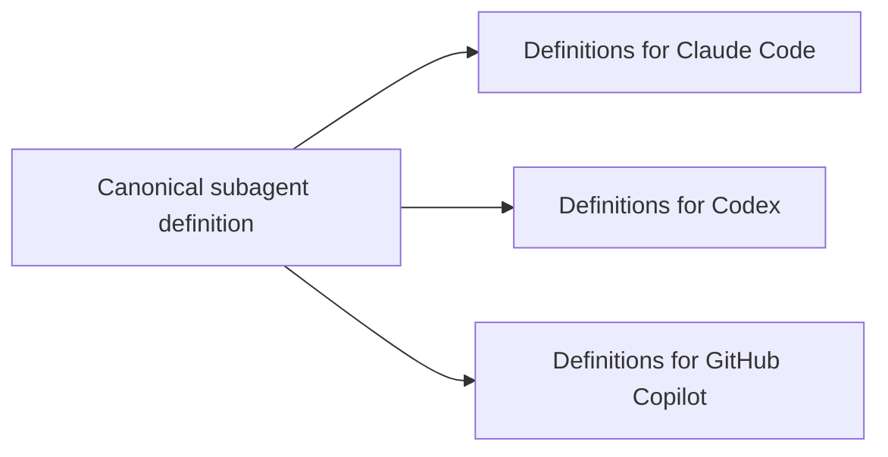

# agent-def-translator


`agent-def-translator` translates one canonical subagent definition into
platform-native subagent files for Claude Code, OpenAI Codex, and GitHub
Copilot.

Use it when you want to keep subagent roles, descriptions, and instructions in
one reviewable TOML file, then generate the files each coding-agent product
expects. It is a translator only: it does not run agents, manage sessions,
resume tasks, or provide an orchestration runtime.



## Status

This project is currently alpha software. The core translation model is usable,
but the canonical definition shape and target-specific output formats may change
before a stable release.

## Quick Start

Create a definition directory:

```text
agents/
  repo-explorer.toml
prompts/
  repo-explorer.claude.md
```

Write a canonical definition:

```toml
name = "repo-explorer"
description = "Read repository context and summarize relevant files."
instructions = """
Inspect repository rules, locate the relevant files, and report concise findings
with file paths. Do not edit files.
"""

[targets.claude]
tools = ["Read", "Grep", "Glob"]
permission_mode = "plan"
model = "haiku"
prompt_append_file = "../prompts/repo-explorer.claude.md"

[targets.codex]
model = "gpt-5.4-mini"
sandbox_mode = "read-only"

[targets.copilot]
tools = ["search", "fetch"]
target = "vscode"
```

Validate and generate artifacts:

```bash
uvx agent-def-translator subagent validate --definitions-dir agents
uvx agent-def-translator subagent translate \
  --definitions-dir agents \
  --output-dir generated
```

This writes:

```text
generated/
  claude/agents/repo-explorer.md
  codex/agents/repo-explorer.toml
  copilot/agents/repo-explorer.agent.md
```

Check generated files in CI without rewriting them:

```bash
uvx agent-def-translator subagent diff \
  --definitions-dir agents \
  --output-dir generated
```

`diff` exits with `0` when generated files are current, and `1` when any target
file is missing or stale.

Top-level commands such as `translate` and the older `agent` resource remain as
deprecated aliases for compatibility. Prefer the resource-oriented command:

```bash
uvx agent-def-translator subagent translate \
  --definitions-dir agents \
  --output-dir generated
```

The CLI is organized as resource + predicate commands. Subagent, skill, and MCP
config translation are implemented today. Plugin translation is separate future
scope for plugin manifests, bundling, and distribution concerns.

```bash
uvx agent-def-translator subagent translate --definitions-dir agents --output-dir generated
uvx agent-def-translator skill validate --definitions-dir skills
uvx agent-def-translator skill translate --definitions-dir skills --output-dir generated
uvx agent-def-translator mcp validate --definitions-dir mcp
uvx agent-def-translator mcp translate --definitions-dir mcp --output-dir generated
```

## Documentation

- [CLI usage](docs/cli.md): command reference and common workflows.
- [Definition format](docs/definition-format.md): TOML fields, target tables,
  prompt composition, and output paths.
- [MCP config format](docs/mcp-config-format.md): TOML fields and generated MCP
  config fragments for Claude Code, Codex, and GitHub Copilot.
- [Skill format](docs/skill-format.md): TOML fields and generated skill
  directories for Claude Code, Codex, and GitHub Copilot.
- [Platform references](docs/references.md): official documentation used to
  ground target-specific output formats, plus adjacent future-scope concepts
  such as MCP.
- [Development](docs/development.md): local setup, tests, checks, and optional
  E2E smoke tests.

## Python API

The command line interface is the recommended integration point for downstream
repositories because it keeps callers dependent on the public command contract.
A Python API is available for advanced embedding:

```python
from pathlib import Path

from agent_def_translator import Target, generate

generated = generate(
    definitions_dir=Path("agents"),
    output_dir=Path("generated"),
    targets=(Target.CLAUDE, Target.CODEX, Target.COPILOT),
)
```

## Scope

- Canonical definitions live in TOML files.
- Platform-specific differences live in `[targets.<target>]` tables.
- Generated files are deterministic and disposable.
- The canonical format captures shared role intent; native platform files are
  generated as target-specific projections.
- MCP server implementation is out of scope, but MCP config definitions can be
  translated into target-specific config fragments.
- Plugin packaging is out of scope for the current renderer.
- Concrete workflow skill examples are intentionally tiny, such as
  `examples/skills/hello/SKILL.md`.

## License

MIT License. See `LICENSE`.
