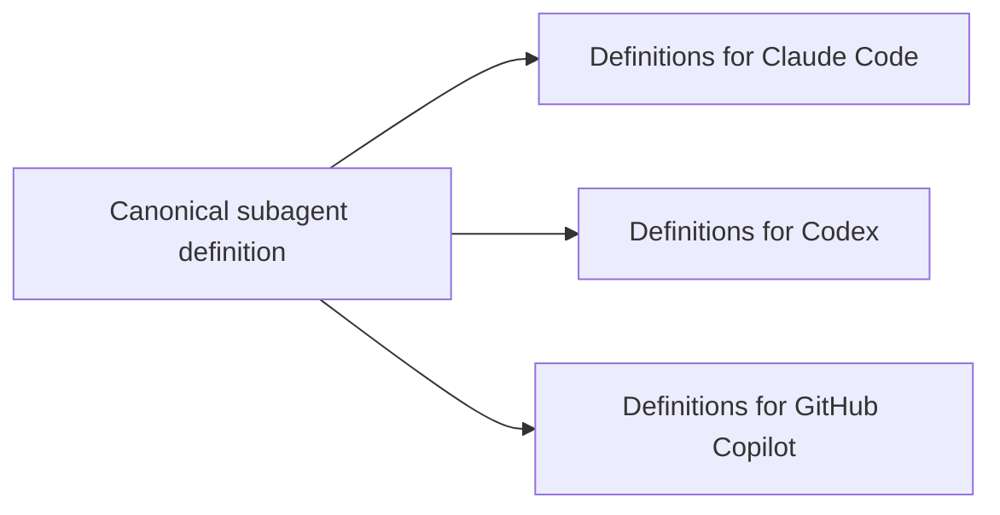

# agent-def-translator


`agent-def-translator` translates canonical agent resource definitions into
platform-native files for Claude Code, OpenAI Codex, and GitHub Copilot.

Use it when you want to keep subagent roles, descriptions, and instructions in
one reviewable TOML file, then generate the files each coding-agent product
expects. It can also translate skill definitions, MCP config definitions, and
plugin bundle definitions. It is a translator only: it does not run agents,
manage sessions, resume tasks, or provide an orchestration runtime.



## Status

This project is currently alpha software. The core translation model is usable,
but the canonical definition shape and target-specific output formats may change
before a stable release.

## Quick Start

Create a definition directory:

```text
agents/
  repo-explorer.toml
prompts/
  repo-explorer.claude.md
```

Write a canonical definition:

```toml
name = "repo-explorer"
description = "Read repository context and summarize relevant files."
instructions = """
Inspect repository rules, locate the relevant files, and report concise findings
with file paths. Do not edit files.
"""

[targets.claude]
tools = ["Read", "Grep", "Glob"]
permission_mode = "plan"
model = "haiku"
prompt_append_file = "../prompts/repo-explorer.claude.md"

[targets.codex]
model = "gpt-5.4-mini"
sandbox_mode = "read-only"

[targets.copilot]
tools = ["search", "fetch"]
target = "vscode"
```

Validate and generate artifacts:

```bash
uvx agent-def-translator subagent validate --definitions-dir agents
uvx agent-def-translator subagent translate \
  --definitions-dir agents \
  --output-dir generated
```

This writes:

```text
generated/
  claude/agents/repo-explorer.md
  codex/agents/repo-explorer.toml
  copilot/agents/repo-explorer.agent.md
```

Check generated files in CI without rewriting them:

```bash
uvx agent-def-translator subagent diff \
  --definitions-dir agents \
  --output-dir generated
```

`diff` exits with `0` when generated files are current, and `1` when any target
file is missing or stale.

Bundle generated resources into target-native plugin directories:

```bash
uvx agent-def-translator plugin translate \
  --definitions-dir plugins \
  --output-dir generated
```

Top-level commands such as `translate` and the older `agent` resource remain as
deprecated aliases for compatibility. They are scheduled for removal no earlier
than `agent-def-translator` 1.0.0. Prefer the resource-oriented command:

```bash
uvx agent-def-translator subagent translate \
  --definitions-dir agents \
  --output-dir generated
```

The CLI is organized as resource + predicate commands. Subagent, skill, MCP
config, and plugin bundle translation are implemented today.

```bash
uvx agent-def-translator subagent translate \
  --definitions-dir agents \
  --output-dir generated
uvx agent-def-translator skill validate --definitions-dir skills
uvx agent-def-translator skill translate --definitions-dir skills --output-dir generated
uvx agent-def-translator mcp validate --definitions-dir mcp
uvx agent-def-translator mcp translate --definitions-dir mcp --output-dir generated
uvx agent-def-translator plugin validate --definitions-dir plugins
uvx agent-def-translator plugin translate \
  --definitions-dir plugins \
  --output-dir generated
```

## Documentation

- [CLI usage](docs/cli.md): command reference and common workflows.
- [Definition format](docs/definition-format.md): TOML fields, target tables,
  prompt composition, and output paths.
- [MCP config format](docs/mcp-config-format.md): TOML fields and generated MCP
  config fragments for Claude Code, Codex, and GitHub Copilot.
- [Skill format](docs/skill-format.md): TOML fields and generated skill
  directories for Claude Code, Codex, and GitHub Copilot.
- [Plugin bundle format](docs/plugin-format.md): TOML fields and generated
  plugin bundle directories, manifests, MCP bundle files, and Codex marketplace
  metadata.
- [Platform references](docs/references.md): official documentation used to
  ground target-specific output formats, plus adjacent future-scope concepts
  such as MCP.
- [Development](docs/development.md): local setup, tests, checks, and optional
  E2E smoke tests.
- [Release process](docs/release.md): version policy, release checklist,
  prerelease flow, and publish failure notes.

## Python API

The command line interface is the recommended integration point for downstream
repositories because it keeps callers dependent on the public command contract.
A Python API is available for advanced embedding:

```python
from pathlib import Path

from agent_def_translator import Target, generate

generated = generate(
    definitions_dir=Path("agents"),
    output_dir=Path("generated"),
    targets=(Target.CLAUDE, Target.CODEX, Target.COPILOT),
)
```

## Scope

- Canonical definitions live in TOML files.
- Platform-specific differences live in `[targets.<target>]` tables.
- Generated files are deterministic and disposable.
- The canonical format captures shared role intent; native platform files are
  generated as target-specific projections.
- MCP server implementation is out of scope, but MCP config definitions can be
  translated into target-specific config fragments.
- Plugin definitions package generated subagents, skills, and MCP config
  fragments into target-specific plugin bundles. They do not define new agent
  behavior.
- Concrete workflow skill examples are intentionally tiny, such as
  `examples/skills/hello/SKILL.md`.

## Development

This repository uses [lefthook](https://lefthook.dev/) to run the same checks as
CI locally, so problems surface before they reach CI.

```sh
# Install dependencies
uv sync

# Install the Git hooks (once; requires lefthook on your PATH)
lefthook install
```

Once installed, the hooks run automatically:

- **pre-commit**: `uv run poe check`
- **pre-push**: `uv run poe check` and `uv run poe test`

You can also run the checks manually:

```sh
uv run poe check
uv run poe test
```

CI still runs the full matrix (see `.github/workflows/`); the hooks only bring that
feedback earlier on your machine.

## License

MIT License. See `LICENSE`.
